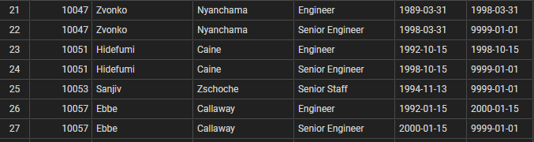

# Pewlett-Hackard Analysis

## Project Overview
We are helping Bobby, an HR analysis working at Pewlett-Hackard (PH), examine the number of potential job openings in the company by looking at the number of employees eligible for retirement. 

## Results
There are several conclusions based on the two deliberables. Some major points include;

- Point 1

- Our first search for employees eligible for retirement resulted in a table of over 133,000 results. However, as we can see from this image, there are employees listed more than once, as each job title they have held returned a separate result. 

As there were 133,376 positions listed, but only 90,398 unique employees on the same list, we can summarize that employees at PH born between 1952 and 1955 had an average of 1.5 positions within the company. Many of these roles involve adding "Senior" to their job title (instead of truly changing positions), so we can summarize that most employees at Pewlett-Hackard stay in their role for most of their career, and do not change roles often. 

- Point 3
- Point 4 

## Summary

### Just How Many Are Retiring?
Pewlett-Hackard needs to make a plan for hiring a large number of employees in the upcoming years, to prepare for the upcoming "silver tsunami." There are approximately 90,000 employees ready for retirement, as determined by our "Unique Titles" table. This summarizes that, of the employees born between 1952 and 1955, there are 90,398 unique titles that are currently held (and not prior roles that these employees held). 

### Are There Enough Mentors?
By looking at currently-employed employees born in 1965, we can see that around 1549 employees could be eligible to mentor the next generation of employees. If Pewlett-Hackard aims to replace all 90,398 retirees, there would be around 58 new hires to mentor for each of the employees born in 1965 - which is not exactly a reasonable number if PH expects their mentors to still fulfill their standard job duties. 

With this in mind, it would likely be beneficial to expand our search of eligible mentors to include more than just employees born within a single calendar year, as there are not nearly enough employees to mentor the new hires, unless they are going to switch mentoring to their new full-time job duties. 

### Additional Considerations / Future Investigations 
In addition, an additional query could be done to examine the length of time employees have worked at Pewlett-Hackard, instead of only their birth year. By searching for staff who have been with the company for a while, regardless of their age, we can be sure to find qualified mentors to teach the next generation of PH employees. 

Another query would involve examining the number of years an employee has worked for PH. Despite being born between 1952 and 1955, employees may be aiming for a total number of years worked to maximize their retirement benefits, or are potentially not eligible to retire if they just started working with the company recently. By incorporating start date (or from_date, for their earliest position on record), we can get a better idea of if the employees identified by their birth year are truly ready for retirement or not. 