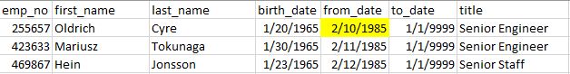
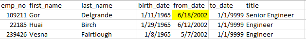
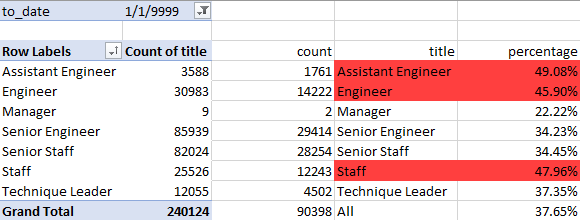

# Pewlett-Hackard Analysis

## Project Overview
We are helping Bobby, an HR analysis working at Pewlett-Hackard (PH), examine the number of potential job openings in the company by looking at the number of employees eligible for retirement. We can also count the number of employees that hold particular positions, as well as the number of slightly younger employees who may be eligible to be mentors for PH's new hires, to ensure we have a peaceful transition after these employees retire.  

## Results
There are several conclusions based on the two deliberables. Some major points include;

- Our first search for employees eligible for retirement resulted in a table of over 133,000 results. However, as we can see from this image, there are employees listed more than once, as each job title they have held returned a separate result. To find the true number of employees retiring (and number of open positions they would leave), we can filter further in order to get the number of unique employee numbers in this "Retirement Titles" list. 

<p align="center">

</p>

As there were 133,376 positions listed, but only 90,398 unique employees on the same list, we can summarize that employees at PH born between 1952 and 1955 had an average of 1.5 positions within the company. Many of these roles involve adding "Senior" to their job title (instead of changing positions or departments), so we can summarize that most employees at Pewlett-Hackard stay in their role for most of their career, and do not change roles often. 

- Looking at our "Unique Titles" table, a quick visual inspection would lead us to assume that many of the retiring employees have the word "Senior" in their position title. By utilizing a quick Excel function, it is revealed that 57,668 employees on this list have titles that begin with the word "Senior."

```
=COUNTIF(D:D,"Senior *")
``` 

Over half of the positions of employees eligible for retirement are Senior positions (almost 2/3 in fact), which means that depending on PH's criteria for earning this title, they will need some more Junior positions to be trained and promoted, or will need to center their hiring efforts around hiring Senior positions to ensure they have a similar skill level across all employees after these employees retire. 

- By sorting the "Mentorship Eligibility" table, we can see that employees born in 1965 have worked in their current role for a number of years. The start date for these employees range from 1985 to 2002. (Images below show the top 3 results when sorting by ascending and descending order for the start date).
    

    

This does not include, however, the total amount of time worked at PH, which could be more if an employee has held more than one role (including Engineer and Senior Engineer, as these are two separate start dates).

Knowing that the mentors will have 20-35 years of experience in their current role means that selecting employees based on their birth year and not total years of experience worked for this example, and also suggests that PH has not hired any employees born in 1965 since 2002 (although they could have hired some that are no longer employed). 

- By filtering unique position titles that appear in our tbale of employees eligible for retirement, we can count the number of positions for each job title that will be open as PH works to replace the retirees, as summarized in our "Retiring Titles" table. Although this was not directly included in the deliverables, the following is an example of additional summaries we can make. Comparing the values in this list to the counts of each job titles from the Titles table (which holds titles for all employees), and filtering to only show counts of currently staffed positions (that is, ones with to_dates of 1/1/9999), we can gather the percentage of positions that will need to be filled for each role.

    

This table shows that our 90,398 potential retirees make up 37.65% of the open positions at Pewlett-Hackard, and the Assitant Engineer, Engineer, and general 'Staff' positions are the most impacted, with close to 50% expected turnover for each. The 'count' and 'title' columns are from the "Retiring Titles" table, and the data on the left was pulled from a Pivot table from the "Titles" table. A percentage was calculated for each position as number of retirees as a percentage of the total number of employees in that position. 

## Summary

### Just How Many Are Retiring?
Pewlett-Hackard needs to make a plan for hiring a large number of employees in the upcoming years, to prepare for the upcoming "silver tsunami." There are approximately 90,000 employees ready for retirement, as determined by our "Unique Titles" table. This summarizes that, of the employees born between 1952 and 1955, there are 90,398 unique titles that are currently held (and not prior roles that these employees held). As we can see from our table above, that is almost 38% of PH employees, so they will need a very deliberate plan to ensure their hiring and training process leaves them fully staffed after these employees retire. 

### Are There Enough Mentors?
By looking at currently-employed employees born in 1965, we can see that around 1549 employees could be eligible to mentor the next generation of employees. If Pewlett-Hackard aims to replace all 90,398 retirees, there would be around 58 new hires to mentor for each of the employees born in 1965 - which is not exactly a reasonable number if PH expects their mentors to still fulfill their standard job duties. 

With this in mind, it would likely be beneficial to expand our search of eligible mentors to include more than just employees born within a single calendar year, as there are not nearly enough employees to mentor the new hires, unless they are going to switch mentoring to their new full-time job duties. 

### Additional Considerations / Future Investigations 
In addition to expanding the mentorhsip eligibility to include those born in more than just 1965, an additional query could be done to examine the length of time employees have worked at Pewlett-Hackard, instead of only their birth year. By searching for staff who have been with the company for a while, regardless of their age, we can be sure to find qualified mentors to teach the next generation of PH employees. 

Another query would involve examining the number of years an employee has worked for PH. Despite being born between 1952 and 1955, employees may be aiming for a total number of years worked to maximize their retirement benefits, or are potentially not eligible to retire if they just started working with the company recently. By incorporating start date (or from_date, for their earliest position on record), we can get a better idea of if the employees identified by their birth year are truly ready for retirement or not. 